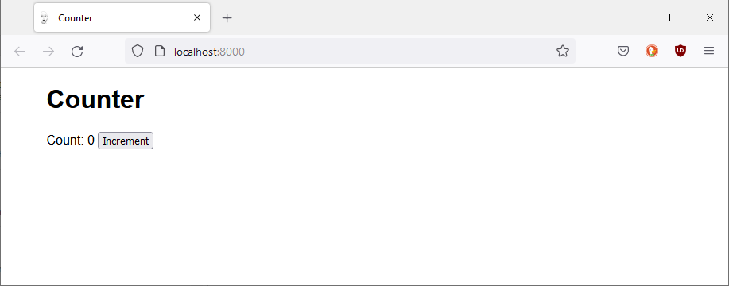

# Counter

**Einstiegsbeispiel mit Node.js/Express.js**

## Setup

**Ausgangslage**: Sie haben Node.js mit NPM installiert und es ist lauffähig. (Ansonsten: siehe [Kurzanleitung](https://code.frickelbude.ch/ipt6/filter-map-reduce#filter-map-reduce) im Beispiel der letzten Woche.)

**Vorgehen**: Erstellen Sie einen persönlichen _Fork_ von diesem Repository und klonen Sie anschliessend dieses.

Installieren Sie die Abhängigkeiten, indem Sie im aktuellen Arbeitsverzeichnis den folgenden Befehl ausführen:

    npm install

Anschliessend können Sie die Anwendung folgendermassen starten:

    node app.js

Dabei sollte folgende Ausgabe erscheinen:

    Counter app listening on port 8000.

## Testen

Öffnen Sie die Seite [localhost:8000](http://localhost:8000) mit einem aktuellen Browser Ihrer Wahl. Sie sollten folgendes sehen:

In Ihrem Terminal, in dem Sie vorher mit `node app.js` die Anwendung gestartet haben, sollte folgende Ausgabe erscheinen:

    GET /count

Betätigen Sie nun die Schaltfläche _Increment_ mehrmals. Dadurch sollte sich der _Count_ verändern:

Im Terminal sollte die Ausgabe mittlerweile angewachsen sein:

    PUT /increment
    PUT /increment
    PUT /increment
    PUT /increment
    PUT /increment
    PUT /increment

## Aufgaben

**Hinweis**: Die folgenden Aufgaben werden später noch mit mit weiterführenden Hinweisen ergänzt. Versuchen Sie bereits, diese ohne weitere Hilfestellungen zu lösen. Sollten Sie das nicht schaffen, können Sie es mit den Hilfestellungen später noch einmal versuchen.

### 1) Analyse

Für diese Aufgabe benötigen Sie einerseits den Code im `static/`-Unterverzeichnis, andererseits denjenigen von `app.js`. Für die Analyse benötigen Sie auch die Developer Tools, insbesondere den Tab _Netzwerkanalyse_.

**Beschreiben Sie in Worten was passiert, wenn die Schaltfläche _Increment_ betätigt wird.** Welche Schritte laufen nacheinander ab? Welcher Code wird ausgeführt? Welche Daten werden zwischen Client und Server ausgetauscht? Was hat es im Tab _Netzwerkanalyse_ mit dem _Status_ und der _Methode_ auf sich? Warum wird der gleiche _Count_-Wert angezeigt, wenn man die Seite in einem anderen Tab oder Browserfenster öffnet?

Halten Sie Ihre Erkenntnisse als Notizen fest!

### 2) Erweiterung

Der Counter wird bei jedem Click um den Wert 1 erhöht. Erweitern Sie die Anwendung um ein Textfeld (`<input type="number" ...>`), in dem Sie einen Wert von 1 bis 10 angeben können. Bei einem Klick auf die Schaltfläche _Increment_ soll der _Counter_ um den entsprechenden Wert erhöht werden.

Für diese Anpassung müssen Sie Änderungen an mehreren Dateien vornehmen:

- `static/index.html`: Erweiterung des Formulars
- `static/client.js`: Auslesen und Übertragen des eingestellten Wertes an den Server
- `app.js`: serverseitige Verarbeitung des Werts

Ein einfacher Lösungsansatz ist es, den Wert als _Query Parameter_, d.h. mit der URL mitzugeben (z.B. `http://localhost:8000/increment?value=7`). Serverseitig können Sie dann prüfen, ob der _Request_ (Variable `req`) über einen entsprechenden Wert verfügt (Tipp: verwenden Sie `console.log()` um `req.query` auszugeben).